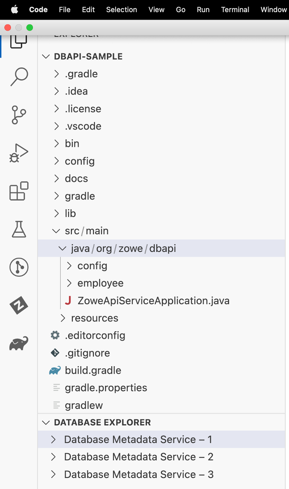
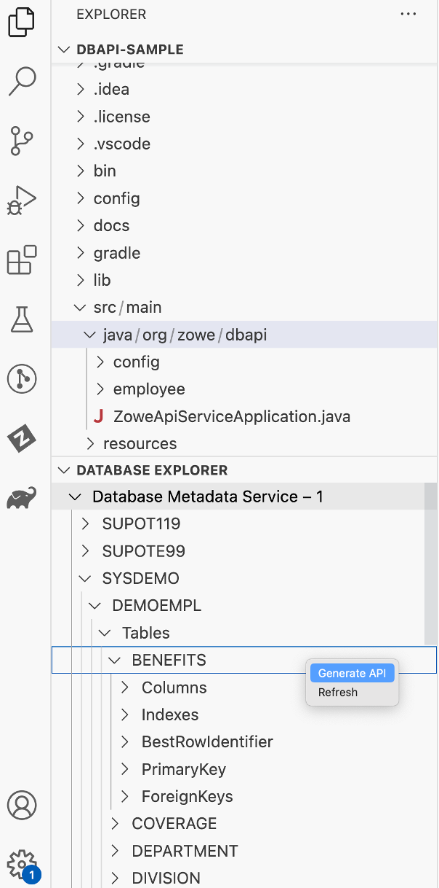
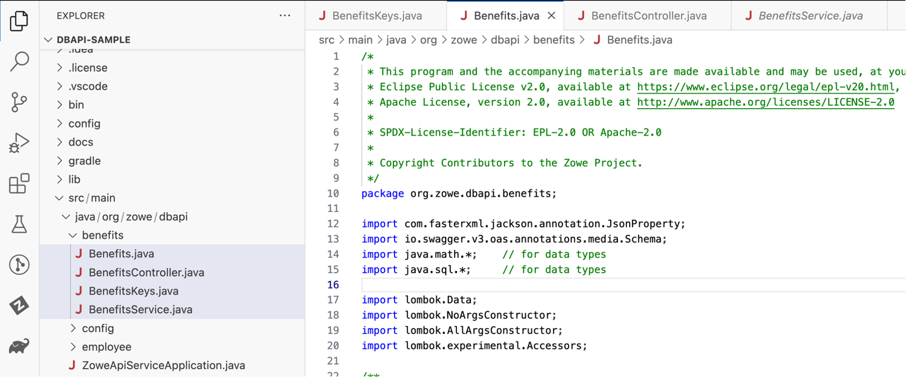
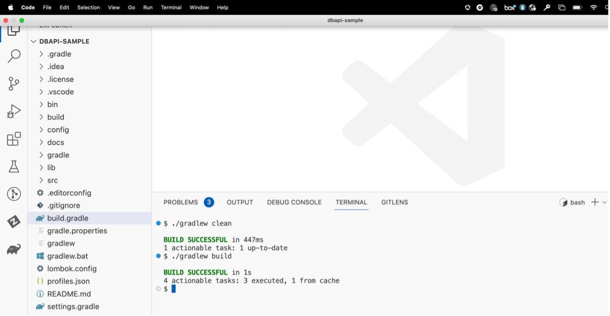
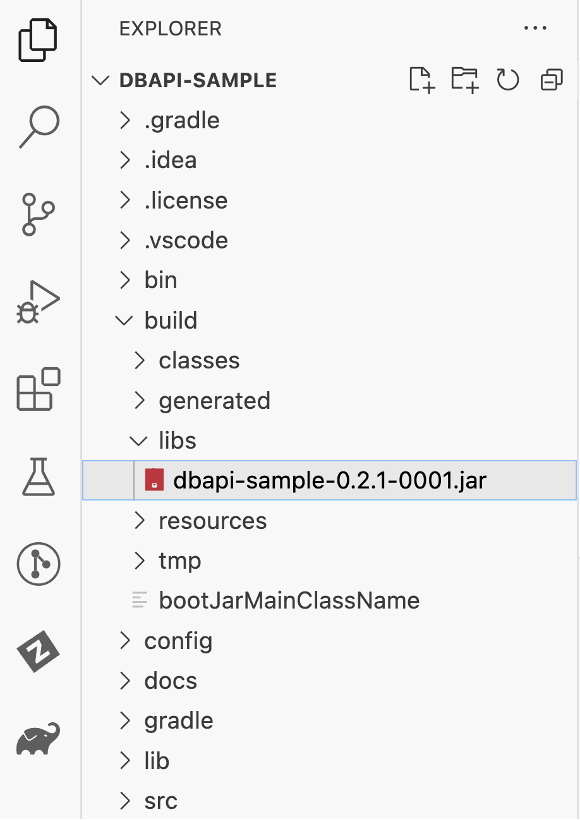
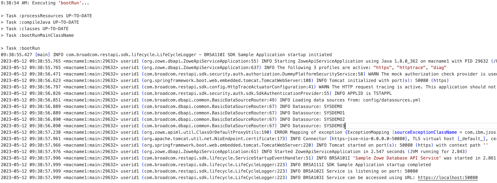
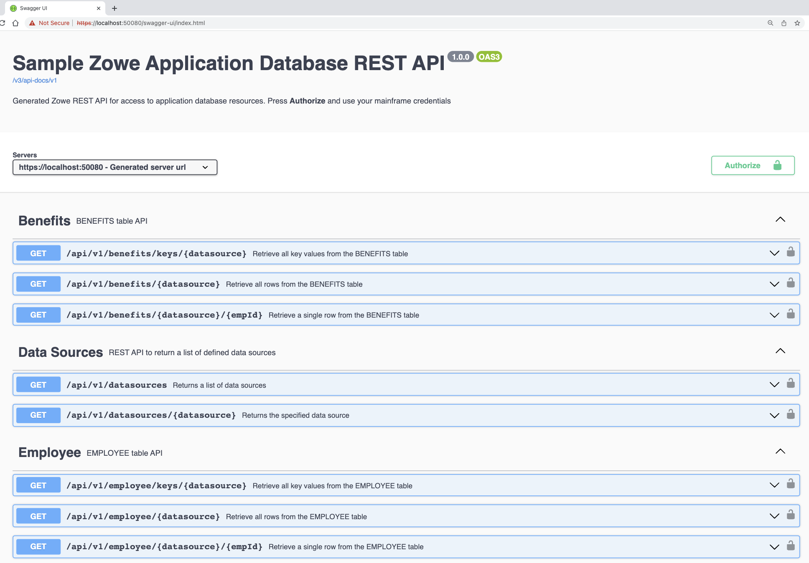

# Database API Sample Project

Use this sample project as a starting point to create Spring Boot REST APIs for Database objects that:

- Supports basic auth via SAF validation (when running on z/OS)
- Provides a framework to generate the database tables as Java classes
- Build custom jar with generated REST API endpoints that access user-defined tables

## Prerequisites

Following platform is required to run the application:

- JDK version 1.8

- VS Code version 1.19.0 or later.

- Broadcom Database Metadata Service is installed and running.

- Broadcom Database API Generator VS Code extension is installed.

## Setup

1. Unzip the dbapi-sample.zip file into local environment (Windows or Mac).  This will be your project folder.

2. From VS Code application, open the unzipped dbapi-sample folder.

3. Update the profiles.json file with Database Metadata Service URLs.

    Example:

        [
            {
                "name": "Database Metadata Service – 1",
                "url": "https://server1.com:12345/api/v1/"
            },
            {
                "name": "Database Metadata Service – 2",
                "url": "https://server2.com:12346/api/v1/"
            },
            {
                "name": "Database Metadata Service – 3",
                "url": "https://server3.com:12347/api/v1/"
            }
        ]

4. The Database API Generator VS Code extension needs your Mainframe credentials and looks for an environment variable called AUTH that contains the base64 encoding of your “userid:password” as expected for basic authentication.

  ### Windows:

    a) Open Command Prompt (cmd) application.
    b) Create a file infile.txt with "mainframe_userid:mainframe_password" in it.
        Example:
          echo user123:pwd1234 > infile.txt
    c) Then run the following command:
          certutil -encode infile.txt outfile.txt
    d) Use the base64 value from outfile.txt to create a new AUTH environment variable.

  ### Mac:

    a) Open Terminal application.
    b) Run the following command:
	      echo -n 'mainframe_userid:mainframe_password' | base64
       Example:
          echo -n "user123:pwd1234" | base64
    c) Update the "~/.bash_profile" with export AUTH=value_generated_from_above_command
    d) Run source ~/.bash_profile to set the value.

## Database API class generation

1. Once Database API Generator VS Code extension is set up, this is how it looks.

DATABASE EXPLORER is the Database API Generator VS Code extension showing Database Metadata Services that were set up in profiles.json



2. Browse to corresponding database table or view and do a right click to use Generate API option to generate Rest API endpoints code for that database table or view.
In the below example, we generated the BENEFITS table present in the DEMOEMPL schema.



3. After successful generation, 4 classes (Keys, Model, Controller and Service) for each table will be generated as shown below for BENEFITS table as an example.



## Build the Database API Sample Project

1. From VS Code Terminal window issue the following commands
  ```bash
    ./gradlew clean

    ./gradlew build
  ```


**Note:** On Windows, use gradlew instead of ./gradlew

2. Once build is successful, dbapi-sample jar file will be created in the build/libs folder.



**Note:** Name and Version of the jar file can be configured in gradle.properties file

## Start and Use your Business API Server on USS:

1. Please follow steps in `Business_API_Server_Installation_Guide` to run this dbapi-sample jar as a Business API Server.

2. Please follow steps in `Business_API_Server_User_Guide` to use Business API Server.

## Start and Use your Business API Server Locally:
1. Please follow these below steps if you would like to run/test this setup locally:

    a) Populate lib subdirectory with the JDBC driver for either IDMS (idmsjdbc.jar) or Datacom(cadcjdbc.jar) from the Broadcom support site.

    b) Tailor the config/local/application.yml file to meet your site requirements by configuring the following variables as necessary.

      – Port (for the Tomcat Server)
        server:
          port: {server-http-port}
            {server-http-port} Use any available Listener Port number of your choice, for example, 50080.

      – Datasources Definition
       Endpoints that have the {datasource} path parameter use JDBC to communicate with IDMS or Datacom. Data source connection parameters are defined in the data sources definition file, config/datasources.yml.
       The location of the datasources.yml file is specified in the dbapi section of the config/local/application.yml file. Please check the `Sample_Project_Setup_Guide` for more information.

       Note: Depending on database you are using, keep the datasource definitions appropriate for that database.

    c) Tailor the config/datasources.yml file to meet your site requirements.

      Properties that are supported by the IDMS or Datacom JDBC driver are specified in YAML format. Please check the `Sample_Project_Setup_Guide` for more information.

       Example - IDMS Data Source Entry

        - dataSourceName: APIDEMO
          description: CV for testing the Database API
          serverName: someserver.com
          portNumber: 10080
          databaseName: APPLDICT
          networkProtocol: IDMS
          externalWait: 0
          resourceInterval: 0
          suspendStrategy: SERVICE
          initialPoolSize: 1
          minPoolSize: 1
          maxPoolSize: 12
          maxIdleTime: 40

       Example – Datacom Data Source Entry

        - dataSourceName: SYSDEMO
          description: MUF for testing the Database API
          proxyName: someserver.com
          portNumber: 5467
          serverName: SYSDEMO_MUF
          networkProtocol: TCP
          initialPoolSize: 1
          minPoolSize: 1
          maxPoolSize: 12
          maxIdleTime: 40

    d) From VS Code Terminal window issue the following commands
       ```bash
       ./gradlew bootRun
       ```
      


  e) Open `https://localhost:<<port-number>>/swagger-ui.html` in your browser or any REST API client (for example HTTPie, REST Client for VS Code, Insomnia, or Postman) to see and run the endpoints.

  For example: `https://localhost:50080/swagger-ui.html` opens Swagger UI with the API Documentation with 3 endpoints for each database table Benefits, Employee generated etc.




## Learn More about Gradle and Spring Boot

### Reference Documentation

For further reference, please consider the following sections:

- [Official Gradle documentation](https://docs.gradle.org)

### Guides

The following guides illustrate how to use some features concretely:

- [Building a RESTful Web Service](https://spring.io/guides/gs/rest-service/)
- [Serving Web Content with Spring MVC](https://spring.io/guides/gs/serving-web-content/)
- [Building a RESTful Web Service with Spring Boot Actuator](https://spring.io/guides/gs/actuator-service/)
- [Setting Up Swagger 2 with a Spring REST API](https://www.baeldung.com/swagger-2-documentation-for-spring-rest-api)
- [Spring Security Basic Authentication](https://www.baeldung.com/spring-security-basic-authentication)
- [Spring Security Authentication Provider](https://www.baeldung.com/spring-security-authentication-provider)

### Additional Links

These additional references should also help you:

- [Gradle Build Scans – insights for your project's build](https://scans.gradle.com#gradle)
